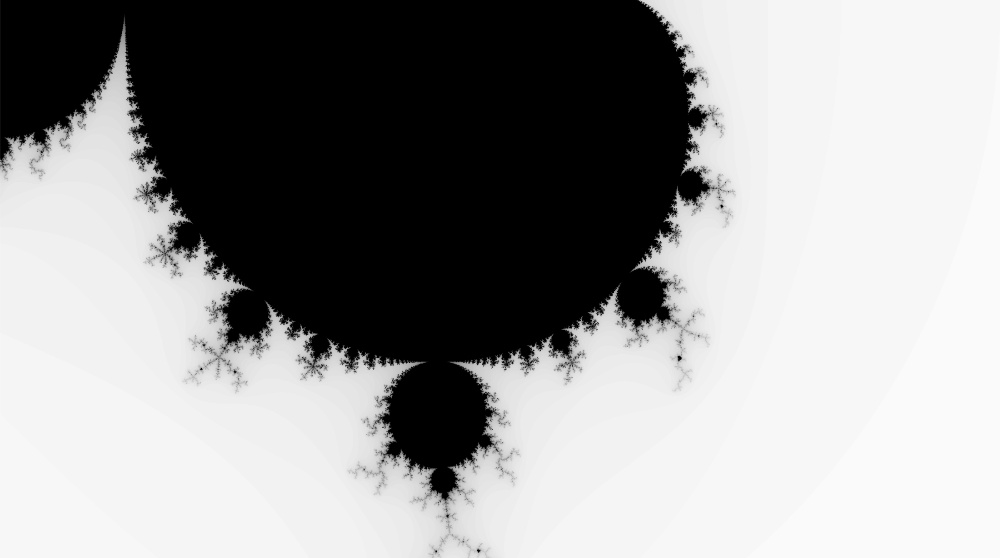
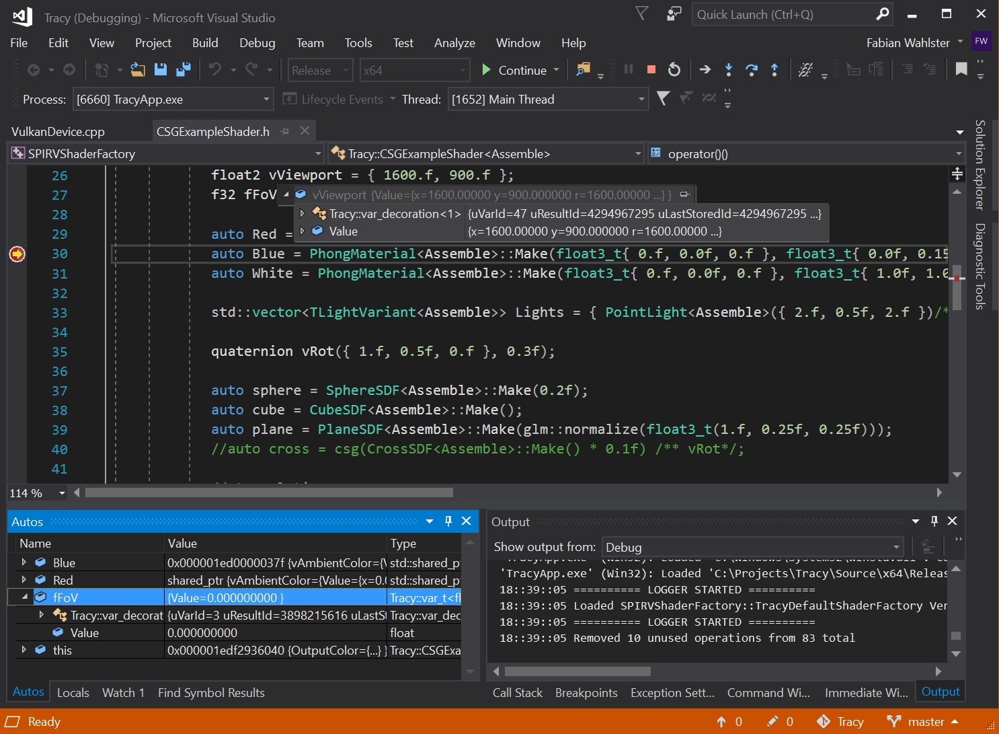

# SPEAR: C++/SPIR-V Shader Runtime

## Overview

SPEAR is a integrated domain specific language translating C++17 to SPIR-V at host runtime.

```cpp
template <bool Assemble = true>
class Mandelbrot : public FragmentProgram<Assemble>
{
public:
	Mandelbrot() : FragmentProgram<Assemble>("Mandelbrot"){};
	~Mandelbrot() {};

	RenderTarget OutputColor;
	inline void operator()()
	{
		f32 i = 0.f, max = 100.f;
		complex c(Lerp(-1.f, 1.f, kFragCoord.x / 1600.f), kFragCoord.y / 900.f);
		complex z(0.f, 0.f);
		While(z.Conjugate() < 4.f && i < max)
		{
			z = z * z + c;
			++i;
		});
		f32 scale = i / max;
		OutputColor = float4(scale, scale, scale, 0.f);
	};
};
```

SPIR-V shader generated from SPEAR code above, rendered with Vulkan:


## Benefits

* Modern C++ features like templating & auto type deduction, Polymorphism
* Software design patterns, modularity and reusability
* Adapting cutting edge GPU features using extension
* C++ Profiling and Debugging Tools
* Quite fast for compiling many shader permutations (Makes it possible to compile during runtime for small shaders)
* Interchangeable Shading Libraries (Hot-swapping shader DLLs during rendering)
* Write meta programs / code generators
* Vulkan interoperability: create PSOs from SPIRVModules



## Restrictions

Please don't use this for production, the codebase is largely untested and not guaranteed to work. See it as a Proof-of-Concept.

* Variable types are rather long outside the SPIRVProgram context
* Ugly macros for If, While, For etc…
* Mixing regular C++ variables and var_t<> has undesired sideeffects
* C++ variables are interpreted as constants 
* Vector components can not be extracted by reference
* Recursion is not supported (will blow up instruction recording)
* Return statements will lead to dead code (not translated)
* Missing keywords switch, continue and break
* Ternary conditional operator? can not be overloaded in C++ (Use Select function instead!)

Please read to accompanying paper [Development of a C++/SPIR-V Shader-Runtime](misc/Paper.pdf) and presentation [slides](misc/Slides.pdf) from the Khronos Meetup for more information.

## Build

No build files provided at the moment, please consider contributing. A C++17 compliant compiler is required! 

### Source code organization

* `SPIRVGen`: Core Spear library
* `SPIRVGenTest`: Simple testbed project
* `SPIRVShaderFactory`: Dynamic shader library example project
* `spirvtools`: Target output folder for spirv-tool cmake
* `boost`: for boost.DLL

`SPIRVGen` library project requires Vulkan-SDK files and HLX (submodule) headers.
`SPIRVGenTest` executable project should link `SPIRVGen`.
`SPIRVShaderFactory` shared library project links `SPIRVGen` and requires boost.DLL libraries for the IPlugin DLL interface. Compile with HDYNAMIC_LINKAGE and HDLL_EXPORT defines to create a dynamic shader library.

## Usage

Please look for the example shaders located at SPIRVShaderFactory folder.

## License
```
Copyright 2018 Fabian Wahlster
Contact: f.wahlster@tum.de

Permission is hereby granted, free of charge, to any person obtaining a copy of this software and associated documentation files (the "Software"), to deal in the Software without restriction, including without limitation the rights to use, copy, modify, merge, publish, distribute, sublicense, and/or sell copies of the Software, and to permit persons to whom the Software is furnished to do so, subject to the following conditions:

The above copyright notice and this permission notice shall be included in all copies or substantial portions of the Software.
Naming the author(s) of this software in any of the following locations: About page, README file, credits.

THE SOFTWARE IS PROVIDED "AS IS", WITHOUT WARRANTY OF ANY KIND, EXPRESS OR IMPLIED, INCLUDING BUT NOT LIMITED TO THE WARRANTIES OF MERCHANTABILITY, FITNESS FOR A PARTICULAR PURPOSE AND NONINFRINGEMENT. IN NO EVENT SHALL THE AUTHORS OR COPYRIGHT HOLDERS BE LIABLE FOR ANY CLAIM, DAMAGES OR OTHER LIABILITY, WHETHER IN AN ACTION OF CONTRACT, TORT OR OTHERWISE, ARISING FROM, OUT OF OR IN CONNECTION WITH THE SOFTWARE OR THE USE OR OTHER DEALINGS IN THE SOFTWARE.
```

## Contributing

The SPEAR project is maintained by Fabian Wahlster and hosted at https://github.com/razor8/SPEAR.

Special thanks go to:
* Mathias Kanzler